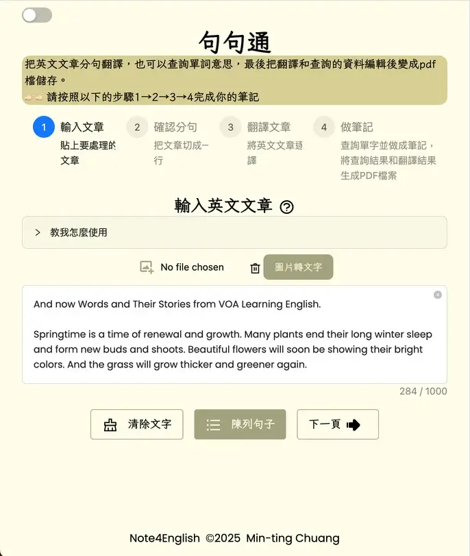
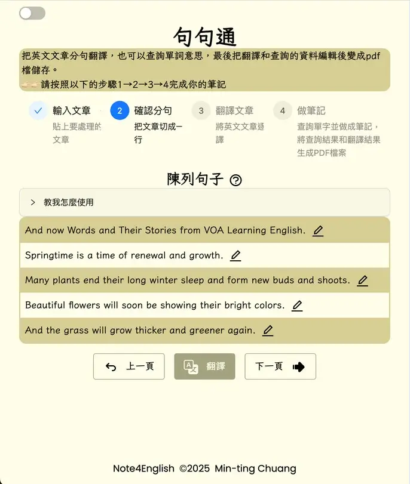

## Introduction

This Vue project provides a comprehensive language learning tool focused on English-Chinese translation. It integrates multiple APIs and custom components to offer users translations, example sentences, and the ability to generate PDF documents from their learning materials. The project emphasizes user-friendly interactions, efficient state management, and seamless integration with third-party services.

## Site Preview

## Skills Used

- **Vue**
- **Tailwind CSS**
- **Ant Design** - UI component library
- **TypeScript**
- **Appwrite**: An open-source backend-as-a-service (BaaS) platform, used for storing images and generating accessible image URLs.
- **Fetch APIs**:
  - OCR Text extraction - convert images to text
  - compromise - NLP library used to detect and extract sentences
  - Microsoft Translator API - Translates text from English to Tranditional Chinese.
  - OpenAI API - Provides detailed word information and example sentences.
  - jsPDF - Generates downloadable PDF documents.

## Application URL

[https://note-4-english.netlify.app/](https://note-4-english.netlify.app/)

## Features

###📷Image to Text Conversion

- Upload images to Appwrite for storage and URL generation.
- Use OCR API to extract text from the uploaded image.

###✂️Natural Language Extraction
- Use the compromise library to split paragraphs into individual sentences.
- Edit the extracted sentences as needed

###🌐English-traditional Chinese Translation
- Input Enter text into the field.
- Use the Microsoft Translator API to translate text into traditional Chinese.
- View results in the Translation Section

###📝Notes Taking
- Select words to generate notes using the OpenAI API.
- View, edit or delete note cards as needed.

###📄PDF Generation
- Collect translated text and notes.
- Generate and download a PDF version of the learning content.

## Contact

For inquiries, feel free to reach out via [**LinkedIn**](https://www.linkedin.com/in/minting0608/)
