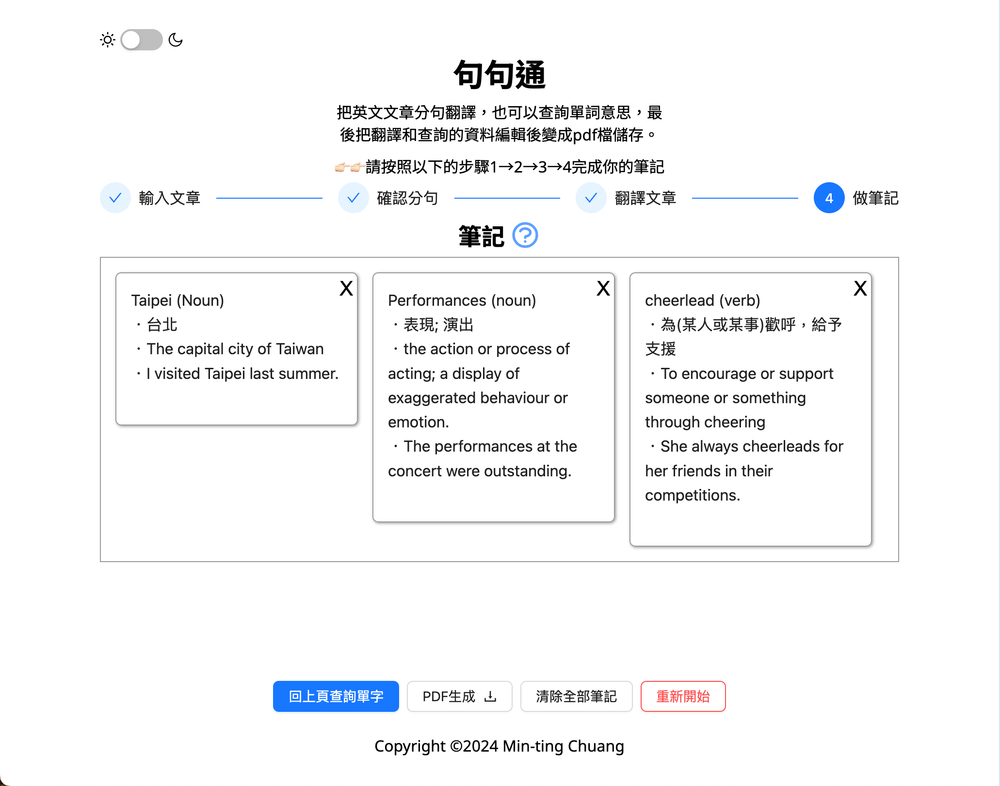

## Introduction
This React project is designed to offer a comprehensive language learning tool for English-Chinese translation. It leverages multiple APIs and custom components to provide users with translations, example sentences, and the ability to generate PDF documents containing their learning materials. The project focuses on user-friendly interactions, efficient state management, and seamless integration with third-party services.

## Site Preview

[Watch the brief introduction on Youtube](https://youtu.be/ZxyWQ9Rzc9M)

## Skills Used
- **React**: For building the user interface.
- **JavaScript**: For scripting and API interactions.
- **CSS**: For styling the application.
- **APIs**:
    - compromise API: For detecting sentences in nlp.
    - Microsoft Translator API: For translating text.
    - OpenAI API: For generating detailed word information and examples.
    - jsPDF: For generating PDF documents.
- **Context API**: For managing global state.
- **Fetch API**: For making network requests.
- **Environment Variables**: For securely managing API keys.

## Application URL
[https://note4english.netlify.app/](https://note4english.netlify.app/)

## Features
**Translation**
1. Enter the text you wish to translate into the input field.
2. Click the "Translate" button.
3. The translated text will be displayed in the TranslationSection.
**Notes**
1. Enter any notes related to your translations in the NotesSection.
2. Click the "Add Note" button to save your note.
3. Your notes will be displayed and can be deleted if necessary.
**PDF Generation**
1. After adding translations and notes, click the "Generate PDF" button.
2. A PDF document containing your translations and notes will be generated and downloaded.

## Contact
For any inquiries, please contact [**lisa_chuang@mail2000.com.tw**](lisa_chuang@mail2000.com.tw)